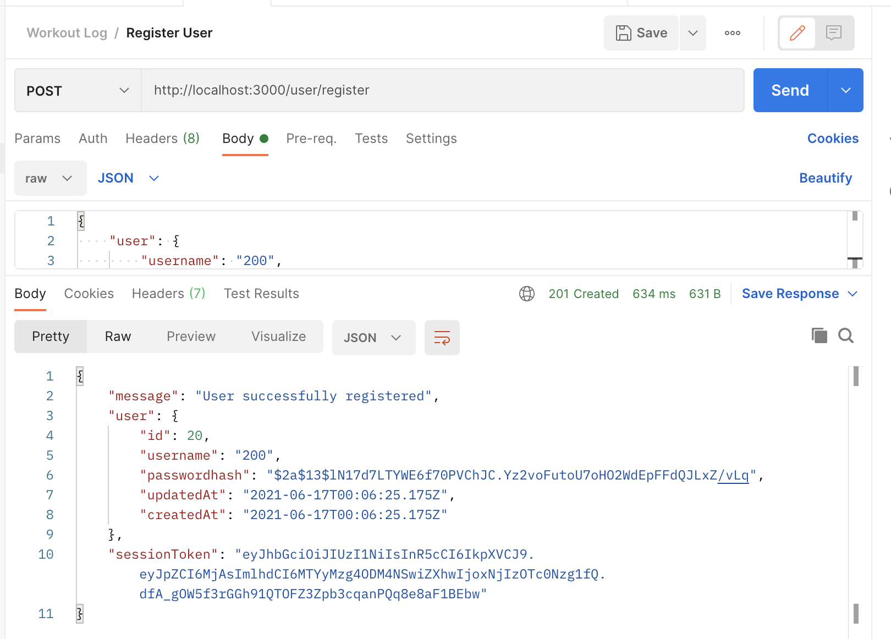
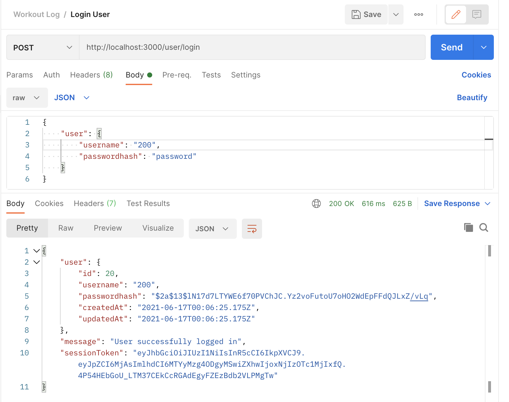
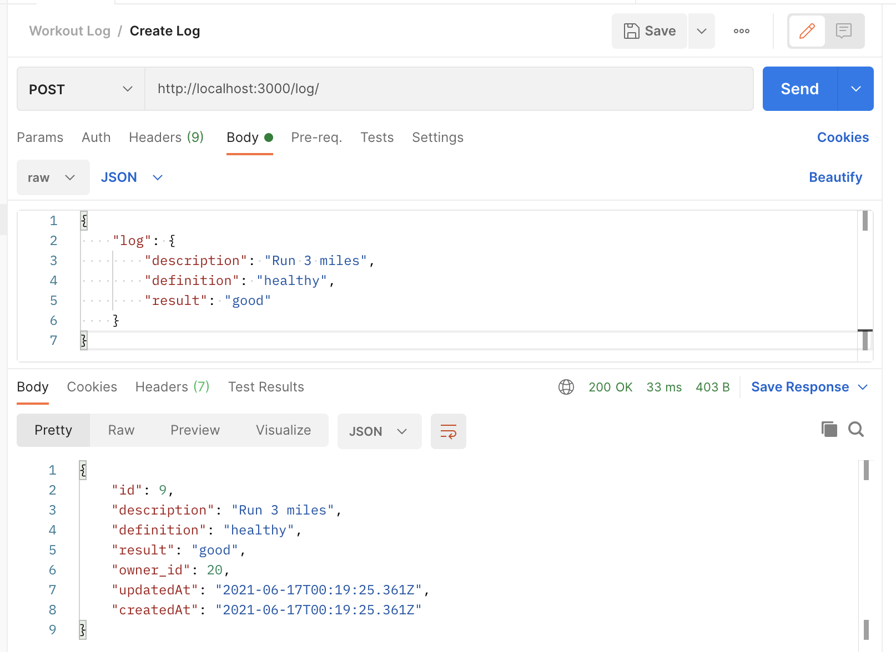
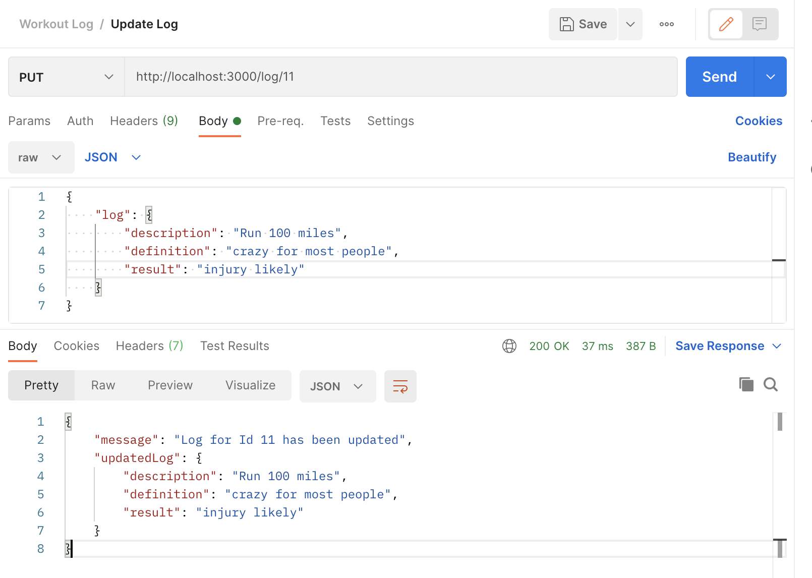
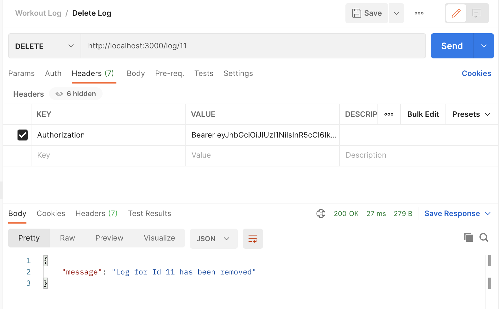
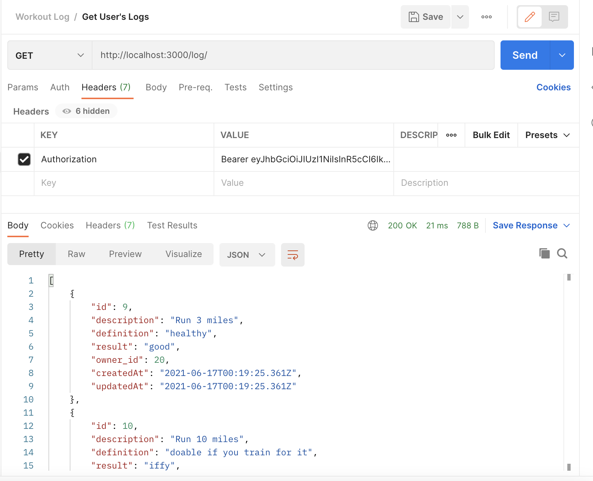
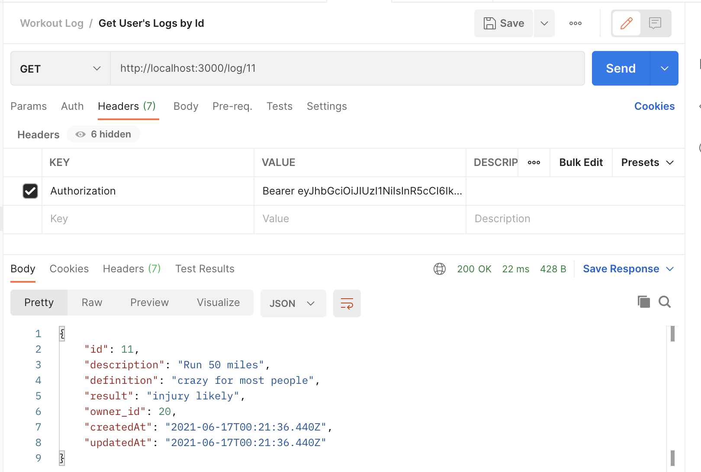

## Workout Log Server

### Steps to begin:
1. Start server:  In terminal, **npx nodemon**.  It should display a message saying that it's listening on port 3000.
2. Open Postman.
3. Open pgAdmin

### Create and Login Users

#### Screenshot -- Register User

#### Screenshot -- Login User

### Create, Update and Delete Workout Log Entries

#### Screenshot -- Create Log

#### Screenshot -- Update Log

#### Screenshot -- Delete Log

### View Log Entries

#### Screenshot -- Get user's logs

#### Screenshot -- Get user's log by Id

